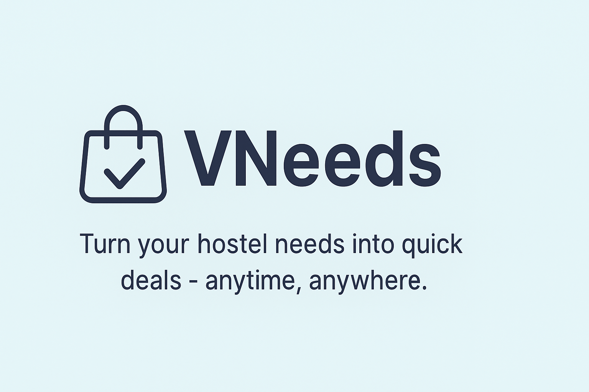

<!-- <p align="center">
  
</p> -->

<h1 align="center">🌐 VNeeds</h1>
<p align="center"><strong>Turn your hostel needs into quick deals — anytime, anywhere.</strong></p>

<p align="center">
  <a href="https://urmi272.github.io/VNeeds/"></a>
  
  <a href="./LICENSE"></a>
</p>

<p align="center">
  <a href="(https://v-needs.vercel.app/)"><strong>🔗 Live Demo</strong></a>
</p>

---

## ✨ About

We ([@urmi272](https://github.com/urmi272) & [@anjalisevkani](https://github.com/anjalisevkani)) noticed that students often buy and sell items informally through WhatsApp groups — messy threads, no real search, and no clear picture of price or availability.

**VNeeds** fixes that with a clean, student-focused marketplace built specifically for hostel life:

- Discover items instantly, filtered to your own block
- Buy & sell with transparent prices and real order tracking
- Chat directly with a buyer or seller instead of scrolling a group chat
- Pay online or in cash, your choice

---

## 🚀 Features

- 🔐 **Real accounts** — email/password auth restricted to a college email domain
- 🛍️ **Buy & sell listings** with name, description, price, category & image
- 🏢 **Block-based discovery** — see what's available in your own hostel block first
- 🧾 **Order tracking** — pending → confirmed → completed, for both buyer and seller
- 💬 **Live chat** between buyer and seller on every order
- ⭐ **Ratings & reviews** — rate a seller once an order is completed
- 🔔 **Notifications** — get pinged on new orders, confirmations, and messages
- ❤️ **Wishlist** that follows you across devices
- 💳 **Online payments** via Razorpay (cards, UPI, netbanking, wallets), plus a manual UPI QR/deep-link fallback and cash option
- 🔍 **Search, category, and price filters**
- 🌙 **Dark mode**
- 📱 **Fully responsive** — works on mobile and desktop
- ⚡ **Real-time updates** — new listings and messages appear live, no refresh needed

---

## 🛠️ Tech Stack

| Layer | Technology |
|---|---|
| Frontend | HTML5, CSS3 (custom design system, CSS Grid), Vanilla JavaScript |
| Auth | Firebase Authentication (email/password) |
| Database | Cloud Firestore (real-time listeners for products, orders, chat, notifications) |
| Payments | Razorpay Checkout |
| Hosting | GitHub Pages |

---

## 📸 Screenshots

> _Screenshots coming soon._

| Landing Page | Dashboard | Sell Form |
|---|---|---|
| _add screenshot_ | _add screenshot_ | _add screenshot_ |

| Product Modal | Orders & Chat | Dark Mode |
|---|---|---|
| _add screenshot_ | _add screenshot_ | _add screenshot_ |

---

## 🏗️ Getting Started (run it yourself)

```bash
git clone https://github.com/urmi272/VNeeds.git
cd VNeeds
```

This is a static site with no build step — but it needs a free Firebase project to actually work (auth + database):

1. Create a project at [console.firebase.google.com](https://console.firebase.google.com)
2. Enable **Authentication → Email/Password**
3. Create a **Firestore Database** (test mode to start)
4. Copy your web app config into `js/firebase-config.js`
5. Publish the security rules in `firestore.rules.txt` under Firestore → Rules
6. (Optional) Add a free [Razorpay](https://dashboard.razorpay.com/signup) test key to `js/razorpay-config.js` for online payments
7. Open `index.html` in a browser, or serve the folder with any static server (e.g. VS Code's Live Server extension)

---

## 📌 Roadmap

- 🖼️ Move product images from base64-in-Firestore to Firebase Storage
- ✅ Server-side payment signature verification for Razorpay
- 🚩 Report / block a user
- 📲 Push notifications (Firebase Cloud Messaging)
- 🧭 Campus-wide search, not just your own block
- 👤 Public seller profile pages with rating history

---

## 🤝 Credits

Built with ❤️ by:

- [Urmi Barman](https://github.com/urmi272)

## 📄 License

Released under the [MIT License](./LICENSE).

---

If you like this project, don't forget to **⭐ star the repo**!
